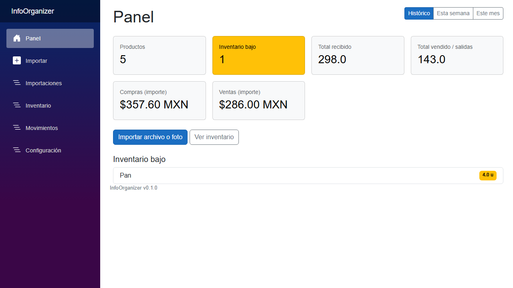
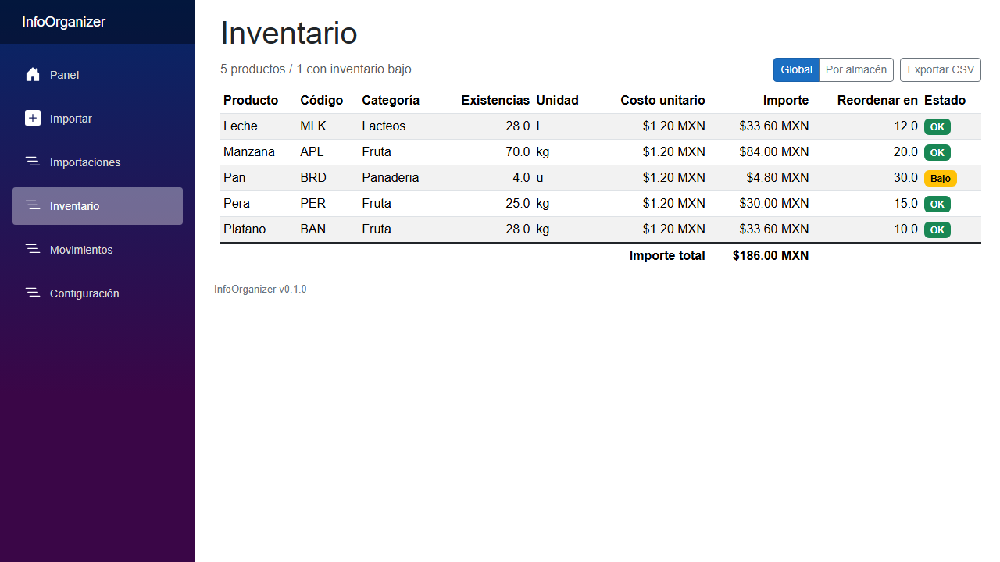

# InfoOrganizer

[](https://github.com/1RV1NG-Y/InfoOrganizer/actions/workflows/ci.yml)
[](LICENSE)

Turn messy records — ad-hoc Excel sheets, CSV exports, and **photos of paper records** — into a clean,
queryable inventory database with full audit traceability. Built for small organizations that track
stock arrivals and sales but have no consistent format for their data.

The defining requirement: the system is **agnostic to the source format**. It never asks you to reshape
your spreadsheet into a template. It reduces every input to one neutral table shape, proposes how the
columns map onto a canonical inventory model (AI-assisted, multilingual), lets a human confirm once,
then **remembers that mapping** so the same format imports automatically next time.



## How it works

```
Excel ─┐                                      ┌─ heuristic + AI column mapping
CSV   ─┼─► RawTable ─► profile/typing ─►──────┤  (proposal → human confirms once)
Photo ─┘   (Claude vision)                    └─► saved SourceProfile (by fingerprint)
                                                          │
                              normalize + confidence score ◄──┘
                                        │
                          ReviewRows (staging: Ready / NeedsReview / Rejected)
                                        │  review by exception, bulk actions,
                                        │  raw-source comparison, human edits
                                        ▼
                     canonical SQLite ledger (Products, StockMovements)
                                        │
                        dashboards · valuation · provenance · CSV export
```

Nothing reaches the inventory ledger without passing a validation gate:

- Every normalized row gets a real **confidence score** (parse quality, mapping certainty, source risk —
  photo rows are scored more cautiously than spreadsheet rows). Clean rows auto-pass; doubtful rows are
  flagged for human review. Rejected rows provably never touch the ledger (there's a test for that).
- Every stock movement traces back through its review row and raw source row to the exact original
  cells that produced it. The import detail page shows the whole chain.
- Unmapped columns are preserved as extra attributes; the original row is always kept verbatim.

## Features

- **Source-agnostic ingestion** — `.xlsx`, `.csv`/`.tsv` (delimiter/BOM/quote tolerant, es-MX `;` +
  comma-decimal aware), and photos of paper tables via Claude vision. Messy sheets with title banners,
  blank rows, and duplicate headers are handled.
- **Mappings that learn** — a column fingerprint keys saved mappings; re-uploads of a known format
  import with no questions asked. New formats get a heuristic proposal (multilingual synonyms — Spanish
  and English) merged with an AI proposal when a key is configured; the app works fully offline for
  spreadsheets without one.
- **Review by exception** — staged rows with statuses, confidence, filters, bulk approve/reject, inline
  editing, and side-by-side raw-source comparison.
- **Operational ledger** — arrivals, sales, and signed adjustments (`Ajuste -1` reduces stock);
  optional per-movement locations with global and per-location stock views.
- **Money, optional** — line values, period purchase/sales summaries, and inventory valuation with a
  latest-known-cost basis. Sheets without prices import fine; no numbers are ever invented.
- **Local-first** — one SQLite file in `%LOCALAPPDATA%\InfoOrganizer`. Your data never leaves your
  machine (the only outbound calls are the optional Anthropic API features). Backup = copy one file.
- **Bilingual UI** — Spanish (es-MX) and English. Follows your browser language, switchable in
  Settings; the target users are small Mexican businesses, so Spanish and MXN are the defaults.



## Install (Windows)

Download the installer from the [latest release](../../releases/latest) and run it. The app opens in
your browser; data lives in `%LOCALAPPDATA%\InfoOrganizer`.

To enable photo import and AI mapping suggestions, paste an Anthropic API key in **Settings** — it is
stored encrypted (Windows DPAPI) and takes effect immediately. Everything else works without a key.

## Run from source

```bash
dotnet run --project src/InfoOrganizer.Web
```

Requires the .NET 10 SDK. The SQLite database is created and migrated automatically. On an empty
database the dashboard offers **Load sample data**, or upload a file from `samples/`.

## Project layout

```
src/
  InfoOrganizer.Domain/       entities, enums, pipeline + mapping contracts, value parsing
  InfoOrganizer.Data/         AppDbContext (SQLite), migrations, SourceProfile store
  InfoOrganizer.Ingestion/    RawTable adapters (Excel, CSV, image) + column profiler
  InfoOrganizer.Mapping/      fingerprint, heuristic mapper, mapping engine
  InfoOrganizer.Ai/           IAiClient + Anthropic implementation (mapping + vision)
  InfoOrganizer.Application/  import/review/tracking services, confidence scorer, composition root
  InfoOrganizer.Web/          Blazor Server UI
tests/InfoOrganizer.Tests/    unit + integration tests (run: dotnet test)
samples/                      example spreadsheets to try
```

Stack: **.NET 10 · Blazor Server · EF Core + SQLite · ClosedXML · Anthropic C# SDK** (structured
outputs, prompt caching).

## Testing

```bash
dotnet test
```

Integration tests run the full ingest → map → stage → review → apply → track flow against a real temp
SQLite database with a faked AI client, so the suite is offline and deterministic. Highlights: CSV/XLSX
parity on the same fixture, signed-adjustment stock reconciliation, saved-profile reuse, confidence
gating, and the ledger-safety test (rejected rows create no movements).

## Eval harness

The "adapts to any format" claim is measured, not asserted. `evals/fixtures/` holds a corpus of
deliberately messy fixtures — title banners, `;`-delimited comma-decimal CSVs, abbreviated headers
(`Cód.`, `P.U.`, `Suc.`), duplicate and English headers, adjustment vocabulary (`merma`,
`corrección`), broken rows, BOM/quoting — each with a ground-truth answer key. The runner pushes
every fixture through the real offline pipeline **without human confirmation** and scores the
automatic mapping proposal:

```bash
dotnet run --project tools/InfoOrganizer.Evals -- run
```

Current corpus results: **100% mapping accuracy (192/192 field expectations), 16/16 stock
reconciliation, 16/16 review-gate correctness.** A CI test gates every push on these numbers
(mapping floor 95%). The harness already paid for itself: its first run caught three real mapper
gaps (abbreviated headers, duplicate-header disambiguation, direction columns detected by sample
values instead of header text), which were then fixed as general mechanisms — and the corpus keeps
growing as new mess is encountered.

## Roadmap

- An eval harness: a corpus of deliberately messy fixtures with measured mapping accuracy and stock
  reconciliation over time
- OpenAI vision as an alternative extraction provider (the pipeline already talks to a provider
  abstraction)
- A hosted web edition (Docker + auth) — the codebase is already a web app; hosting it is a
  deployment profile, not a rewrite

## License

[MIT](LICENSE)
